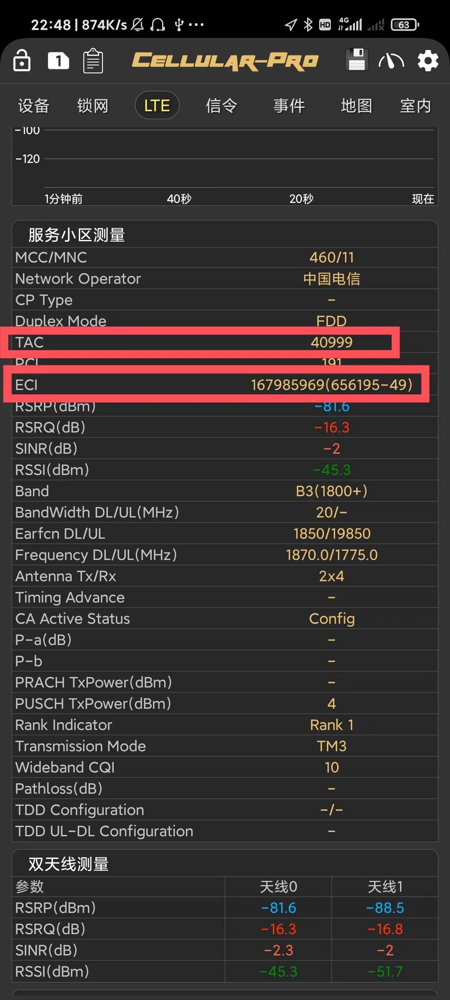

---
title: 【科普向】如何定位你当前使用的基站？
tags: [科普, Network, 基站]
style: fill
color: danger
comments: false
description: README 文件是人们通常最先看到的第一个东西。它应该告诉人们为什么要使用、如何安装、以及如何使用你的代码。README 文件标准化能够使得创建和维护 README 文件更加简单。毕竟，要写好一个文档不是那么容易的。  
---  
众所周知，基站在建设时，运营商就标记了它的GPS坐标，在基站和手机通讯时，也会报告它的位置，这就是小区信息，这里的小区并不是实际上的小区，而是指这座基站信号所覆盖的范围。  
基站信息由两个参数构成：  
>TAC：一般按照城市区域划分，例如城南所有基站一个TAC，城北所有一个TAC，不是唯一值。  
>ECL：小区ID，每个基站（宏站）都不一样，是唯一值  
## 那么要怎么定位呢？
首先，先看你得到的ECL是长号还是短号。  
例如 ECL：167985969  
这就是短号，信号大师中显示的一般是短号，这是不能直接查询的（除非你有工参表）所以需要计算出长号，算法就是把【/】号前面的数x256，再加上【/】号后面的数字就可以算出长号，反正有分隔符的都是短号，如果你想偷懒图二的软件cellular pro能直接查看。(如下图)
  
这就得到了长号，这时关注一些杂七杂八的公众号发送TAC和计算出来的ECL长号就可以查询到了，不推荐网页查询，好多接口都烂了
格式例如：40999，167985969  
这也是部分软件辅助定位的方式，一座城市4G宏站一般覆盖500m²，如果你有使用CPE和需要定向天线增强信号的话，希望这个教程能帮到你。  
另外，请勿用于非法途径！只需要知道三座基站就可以定位得明明白白  
欢迎各位大佬指正