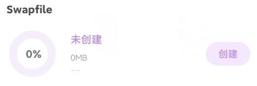
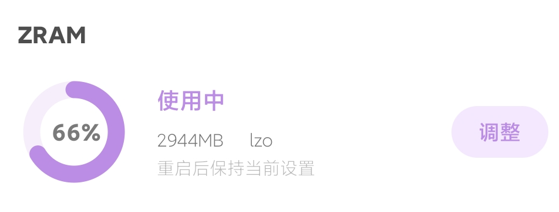
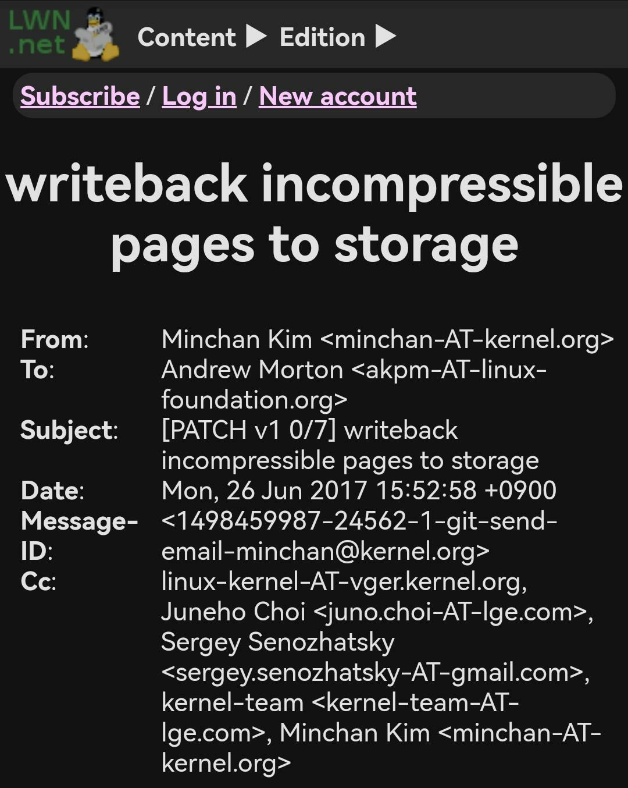

---
title: 【科普向】关于内存拓展你可能需要了解的一些东西
tags: [科普, Swap, 内存扩展]
style: secondary
color: success
comments: false
description: 提到内存拓展，很多人第一时间想到的是安卓2.3时代被玩出花的 Swap。不过到如今用 Swap 一词有失偏颇，因为如今 Swap 不仅仅包含历史最久远的 Swapfile，还包含相对较新的 zram。  
---  
近两年各家纷纷将内存拓展拿上台面大肆宣传，由于各家给这个技术的名字五花八门，因此下文统一使用「内存拓展」一词指代。   

提到内存拓展，很多人第一时间想到的是安卓2.3时代被玩出花的Swap。不过到如今用 Swap 一词有失偏颇，因为如今 Swap 不仅仅包历史最久远的 Swapfile，还包含相对较新的 zram。  

## Swapfile
Swapfile 相信很多人并不陌生，在早期安卓主流内存只有 256M 的时候， Swapfile 作为能有效缓解内存不足的一个解决方案，在当时也是非常流行的。它的原理也很简单，在存储中划出一块区域并挂载为交换分区，内存不够用时将内存中的部分数据转移到存储以腾出空间。这种方案非常简单粗暴，但弊端也很明显。首先手机存储的读写性能是远不如内存的，写入和读取 Swapfile 都会明显拖慢手机运行速度；其次， Swapfile 是直接将内存中的数据无压缩写入存储，读写量较大，对手机存储的寿命影响较大。正是因为这些弊端，在后续安卓开始堆内存， zram 出现之后， Swapfile 也功成身退。目前的安卓机也默认不会创建 Swapfile 。  

  

基于 Swapfile 还有一个衍生技术，那就是 Zswap。Zswap 的作用是将本应写入 Swapfile 的数据进行压缩，先存储到内存的一块区域。当这块区域满了或者内存满了就会将最少使用的数据解压写入 Swapfile。Arch Linux 稳定版内核默认启用 Zswap，安卓的话因为查不到相关资料因此不下定论。

## ZRAM
接下来聊聊 zram 。 zram 并不是什么新鲜的东西， 2014 年 3 月 30 日发布的 Linux 3.14 内核已经包含了 zram 的支持。zram 与 Swapfile 及其衍生的 Zswap 最大的不同在于 zram 可以完全不读写存储。zram 的原理是在内存中划分一块区域并挂载为交换分区，当内存不足时可以将内存中的部分数据进行压缩，然后写入这块区域。目前主流的 zram 压缩算法可以将数据压缩到原始数据的 20-45% 大小，zram 正是靠这个腾出内存空间。这个方案好处是对存储零读写，对数据的读写全部在内存进行，可以利用上内存极快的读写速度；同时因为不需要读写存储，对存储寿命也很友好。但这个方案的弊端同样明显。首先是压缩和解压都需要占用较多的算力，这对于一些低端设备来说是不小的负担；其次，由于 zram 还是存储在内存中，因此 zram 的大小是有限制的。尽管现在 Root 后可以轻松调整 zram 的大小，但是如果 zram 分区过大，会出现 zram 还没用完内存就满了开始杀后台的情况。不过鉴于目前主流安卓手机的性能足够在大部分日常使用场景带动 zram 的压缩与解压，因此目前的绝大部分安卓手机默认启用 zram 且不提供关闭选项。

  

接下来是重头戏，也是近年来各家大肆宣传的技术，那就是 zram 的衍生技术 zram writeback。目前来说 zram writeback 的相关资料还是比较少，我也没有在如 Arch wiki 找到相关资料。经过一番搜索，姑且认为这是 zram writeback 最早被提及的时间。

以这一篇提交来看，zram writeback 最开始是用于将没法压缩的数据写入到存储。不过目前的安卓内核所提供的 zram writeback 则是将 zram 中很少访问的数据标记为 idle，然后过一段时间后将被标记为 idle 的数据写入存储。至于 idle 怎样判定，多久才回写，我并没有查到相关资料，这应该也是各家优化的方向。另外，安卓内核提供的 zram writeback 是可以设置每天的最大写入量的，达到后当天将不会回写任何数据。不过以我手头上的 Pixel 4 和小米的机子来看都没有设置写入限制。zram writeback 的优势在于读写的数据大部分都是经过压缩的，相比 Swapfile 哪怕是配合上 Zswap 的读写量更少；而且也因为是压缩的，所以读写耗时更短。但同样的，因为是压缩数据，还写到了存储，在读写时依旧会占用磁盘IO。而且如果一边压缩或解压一边写入或读取，那简直就是 debuff 叠满。但由于目前的安卓机在大部分场景下不会因为这些 debuff 大幅度拖慢速度，因此各家也在 zram writeback 上发力，并出现了各种新奇的名词。值得注意的是，标记了 idle 的数据才会被回写，也就是说，如果当前 zram 没被标记为 idle 的数据，那么就算内存炸了也没有数据被回写。这在一定程度上可以解释为什么内存拓展对无规律突发性打开大量 APP 基本没什么作用，因为系统都不知道哪些数据可以回写，这情况下回写基本就是个摆设。  

如今的安卓机基本都给加上了内存拓展，即便是谷歌的 Pixel 也不免俗，在 Pixel 4 的最新版系统上也配置了 zram writeback 回写块（还不提供开关）。之前看到过一个说法，zram writeback 在安卓机上本来是为了保持长时间不重启的流畅度，不过如今以我自己的体验来说，确实是将少用的程序缓存给写入存储，一定程度上维护了长时间开机情况下的流畅度。不过 zram writeback 终究会对存储寿命有影响，放心不下的大可直接关掉。  
### 总结
ZRAM（压缩内存） ZRAM是linux的一种内存优化技术，基本工作原理是：通过划定一片区域，将压缩过后的硬盘数据放到zram里，打开解压出来，以实现高速读取，会增加CPU负担，对于现在CPU来说，问题不大，如果是以前老久的CPU话，不建议你开，反而更卡，特别是3A大作，懂得都懂。

磁盘 swap：是把磁盘的一部分作为内存（ZRAM不是），相当与增大了内存， 但是缺点很明显， 当用到swap的时候，速度决定于闪存规格，比如说ufs2.0/2.1/3.0/3.1等等，但是速度差距和内存相差太大了，DDR3都不比一定能超的过

总结要用的话建议ZRAM，效率更高，就是比平时多耗电电而已，CPU频率更高一点，四舍五入忽略不计。除非你打游戏的时候能感觉的出来，也不一定，又不是变聊天边玩游戏